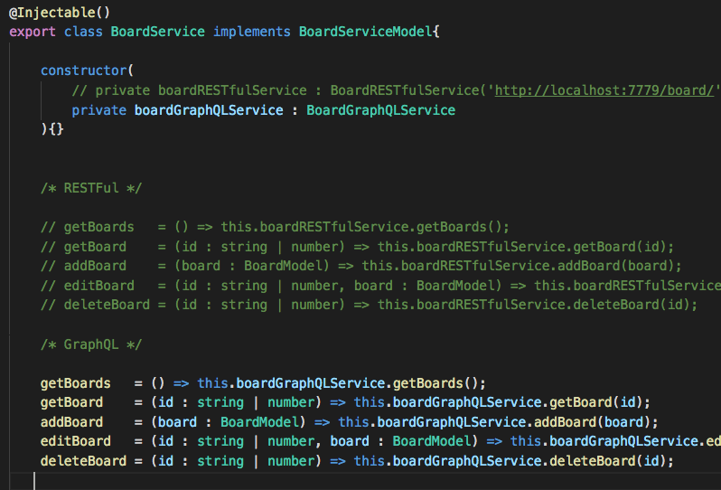
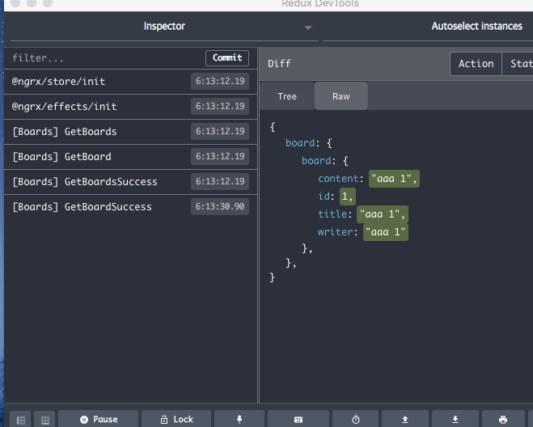
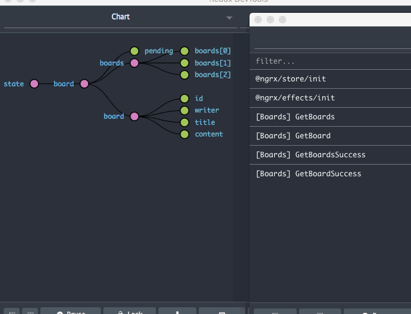
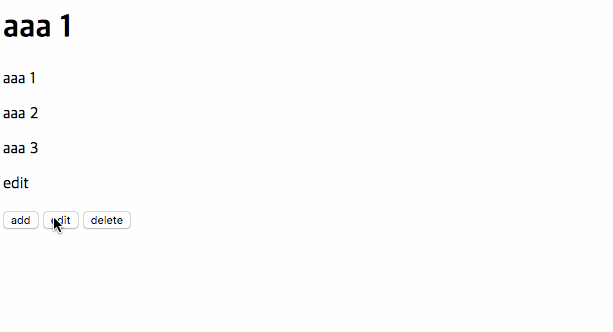

# Install
```shell
npm install
```

# Run Demo
```shell
npm run server:restful
npm run server:graphql
npm start
```

## GraphQL and RESTful API Provider

# Demo






# Code
- `{ BoardActions.ALL }` [board.actions.ts](https://github.com/u4bi/ngrx-crud-side-effect-GraphQL-and-RESTful/blob/master/src/app/providers/board/board.actions.ts)
- `{ boardReducer }` [board.reducer.ts](https://github.com/u4bi/ngrx-crud-side-effect-GraphQL-and-RESTful/blob/master/src/app/providers/board/board.reducer.ts)
- `{ BoardEffects }` [board.effects.ts](https://github.com/u4bi/ngrx-crud-side-effect-GraphQL-and-RESTful/blob/master/src/app/providers/board/board.effects.ts)
- `{ BoardService }` [board.service.ts](https://github.com/u4bi/ngrx-crud-side-effect-GraphQL-and-RESTful/blob/master/src/app/providers/board/board.service.ts)
    - `{ BoardRESTfulService }` [board.restful.service.ts](https://github.com/u4bi/ngrx-crud-side-effect-GraphQL-and-RESTful/blob/master/src/app/providers/board/model/board-restful.service.ts)
    - `{ BoardGraphQLService }` [board-graphql.service.ts](https://github.com/u4bi/ngrx-crud-side-effect-GraphQL-and-RESTful/blob/master/src/app/providers/board/model/board-graphql.service.ts)
- `{ BoardModel, BoardServiceModel }` [board.model.ts](https://github.com/u4bi/ngrx-crud-side-effect-GraphQL-and-RESTful/blob/master/src/app/providers/board/board.model.ts)
- `{ Board }` [board.ts](https://github.com/u4bi/ngrx-crud-side-effect-GraphQL-and-RESTful/blob/master/src/app/providers/board/board.ts)

> ## Requirements
> | Name                   | Type                                                                                             |
> |------------------------|--------------------------------------------------------------------------------------------------|
> | ngrx                   | npm install @ngrx/store @ngrx/effects --save                                                     |
> | graphql-apollo-angular | npm install apollo-angular@beta apollo-angular-link-http@beta apollo-client apollo-cache-inmemory graphql-tag graphql --save                                                     |
> | Restful API Server     | npm install json-server --save                                                                   |
> | GraphQL API Server     | npm install express express-graphql axios --save                                                 |
> | Redux DevTools         | npm install @ngrx/store-devtools --save                                                          |
> | Chrome Extension | https://chrome.google.com/webstore/detail/redux-devtools/lmhkpmbekcpmknklioeibfkpmmfibljd     |
___
